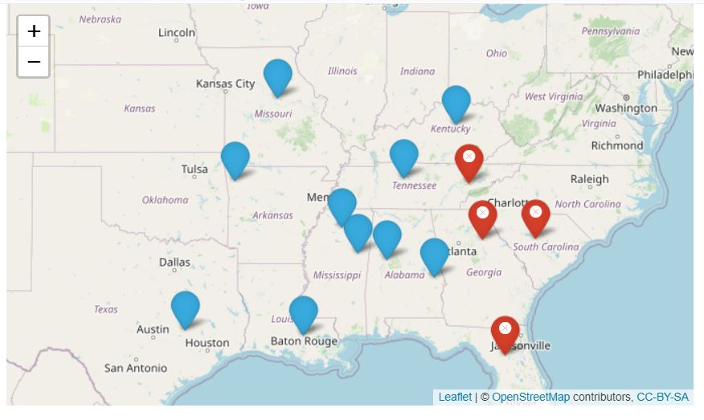
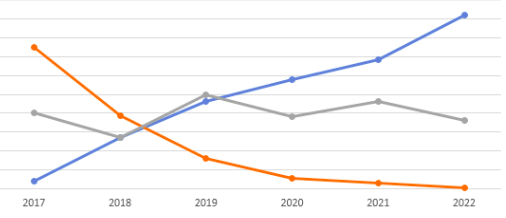
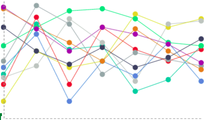
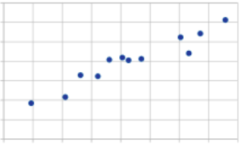
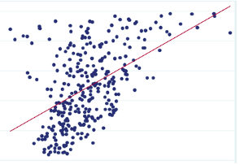
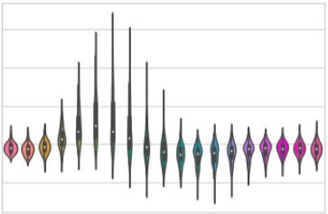
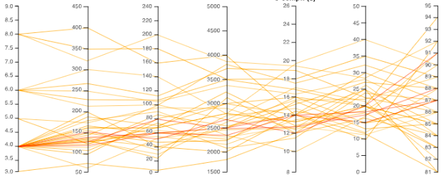

```{r setup, include=FALSE}
knitr::opts_chunk$set(echo = TRUE)
library(jsonlite)
library(httr)
library(dplyr)
```


## Load R Packages & Set Working Directory


## Introduction

Our project will focus on the relationship between college football records and graduation rates. We will
limit this study specifically to the Southeastern Confrence (SEC). We are hoping to answer a series of research questions as part of
an exploratary study of college football success and graduation rates. Our null hypothesis will be that “college
football records have no impact on university graduation rates.” There is reason to believe that a winning
or losing record could impact rates either through a distraction from the academic process or by positively
affecting the spirits of the student body.

Some of the research questions we will focus on:

1. Is there a positive correlation between college sports teams and graduation rates?
2. Is there a correlation between college admission rates and college sports records?
3. Is there a time series component for graduation rates? Does that vary over time?
4. Is there a relationship between cost of attendance and sports teams revenue?
5. If sports team performance does have an impact on academic performance, how long does this last?

## Motivation

Our motivation behind this project is a combination of our interests for college football and statistics. Texas A&M is one of the largest college football schools in the nation and we are very interested to see the impact a good season of football has on students.
Overall, we wanted to pick a genre of research that interests each team member, which is something we have been able to achieve through this project.

## Visualization Design
We followed an E.T.L strategy for our data processing needs.

  

#### Extract
We extracted our data from the following location:

  - **Completion Rates**: https://data.world/databeats/college-completion/workspace/file?filename=cc_institution_grads.csv : records of college completion data from 3,800 degree-granting institutions in the United States.  
 

  - **Sports Records**: https://api.collegefootballdata.com/api/docs/?url=/api-docs.json#/games/getTeamRecords : College football records in the US.

The data we have used is all open source and available for free use without licensing.

#### Transform

In order to successfully perform our evaluation we needed to transform our data set into data specific for our our needs. This began with limiting the data set to only SEC schools.In addition to this we also needed to match the data set of college completetion, with the data set of football records. In order to do this we needed to change the names of the universities. This was done by conducting checks to ensure the correct full names of universities as given in the raw data set. We then ran a loop to change each name of the university to their football team name, in order to match with football records data set.

In the next step of our transformation process, we arranged an identical length vector of identical indecies of university names. These university names are coincident in index between our college football record and graduate rate datasets.

#### Load
Finally, A for loop was utilized to transform the data between the university name nomenclature of one data set to the other.Once the names were idential the data set was able to be merged allowing to form the complete dataset of college completion statistcs for SEC schools along with their corresponding fotoball team records.

We will now go on to summarize the implementation of our visualizations.

#### Visualization 1: Map Selection by University

Visualization Summary: A map of all Universities in the SEC will be displayed. The user will toggle the Universities from a checkbox group which will result in their icons’ visibility being toggled. This method of visualization was used to show the spatial component of the data, as well as to give a high-level overview of which schools are included in the current calculation.

This selection will affect which colleges are included in each of the following visualizations (explained in more detail below): 
- Descriptive Statistics Line Chart
- On Time Graduation Rate Scatter Plot
- On Time Graduation Rate Violin Plot
- Parallel Coordinate Chart  


<!-- {width=50%} -->

#### Visualization 2: Descriptive Statistics Line Chart
This visualization will offer a high level resolution of the currently selected University datasets. The user will be allowed to change the axis between chronological and factor based views correlating graduation rates against football records.

{width=50%}
{width=50%}


#### Visualization 3: On Time Graduation Rate Scatter Plot
The content of this visualization will contain data points relating either the year or the school record to the graduation rate of the university. By adjusting the university checkbox group and changing the date range slider, which colleges and when will be adjusted accordingly. This visualization was selected because we want the user to be able to determine what trends exist from a certain level of precision: did sports records only correlate to graduation rates before a certain year? Or only for certain colleges? Differences in these parameters could really affect the results of the graph.  
{width=50%}
{width=50%}


#### Visualization 4: On Time Graduation Rate Violin Plot
ipsum delor etc  

{width=50%}  


#### Visualization 5: Parallel Coordinate Chart
This visualization will be used to show the relationship between the different variables we are observing: including year, graduation rate, record, etc. This visualization will be useful to detect differences in relationships between different variables between only a few schools, as selected by the multi-checkbox group. For example, for one school you might see a strong correlation between year and graduation rate, and a much weaker correlation in a different school.  
{width=50%}  


#### Methodology and Evaluation

In this section we will break up each research question and discuss how the visualization came to a solution.


1. Is there a positive correlation between college sports teams and graduation rates?

2. Is there a correlation between college admission rates and college sports records?
3. Is there a time series component for graduation rates? Does that vary over time?
4. Is there a relationship between cost of attendance and sports teams revenue?
5. If sports team performance does have an impact on academic performance, how long does this last?

## Evaluation Plan

TODO

## Discussions & Future Work


## Works Cited

data.world (2017). College Completion [Data file]. Retrieved from https://data.world/databeats/college-completion

College Football Data (2022). College Football Data API [Data file]. Retrieved from https://api.collegefootballdata.com/api/docs/?url=/api-docs.json#/games/getTeamRecords
