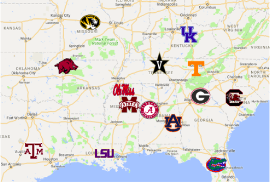

# Visualization 1: Map Selection by University

Visualization Summary: A map of all Universities in the SEC will be displayed. The user will toggle the Universities from a checkbox group which will result in their icons’ visibility being toggled. This method of visualization was used to show the spatial component of the data, as well as to give a high-level overview of which schools are included in the current calculation.

This selection will affect which colleges are included in each of the following visualizations (explained in more detail below): 
- Descriptive Statistics Line Chart
- On Time Graduation Rate Scatter Plot
- On Time Graduation Rate Violin Plot
- Parallel Coordinate Chart  

{width=50%}

# Visualization 2: Descriptive Statistics Line Chart
This visualization will contain data specified within a certain date range, TODO  
{width=50%}
{width=50%}

# Visualization 3: On Time Graduation Rate Scatter Plot
The content of this visualization will contain data points relating either the year or the school record to the graduation rate of the university. By adjusting the university checkbox group and changing the date range slider, which colleges and when will be adjusted accordingly. This visualization was selected because we want the user to be able to determine what trends exist from a certain level of precision: did sports records only correlate to graduation rates before a certain year? Or only for certain colleges? Differences in these parameters could really affect the results of the graph.  
{width=50%}
{width=50%}

# Visualization 4: On Time Graduation Rate Violin Plot
ipsum delor etc  

{width=50%}  

# Visualization 5: Parallel Coordinate Chart
This visualization will be used to show the relationship between the different variables we are observing: including year, graduation rate, record, etc. This visualization will be useful to detect differences in relationships between different variables between only a few schools, as selected by the multi-checkbox group. For example, for one school you might see a strong correlation between year and graduation rate, and a much weaker correlation in a different school.  
{width=50%}  

